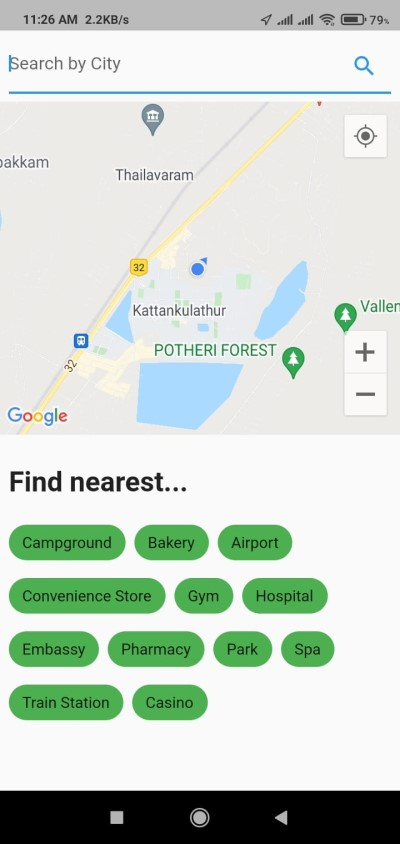
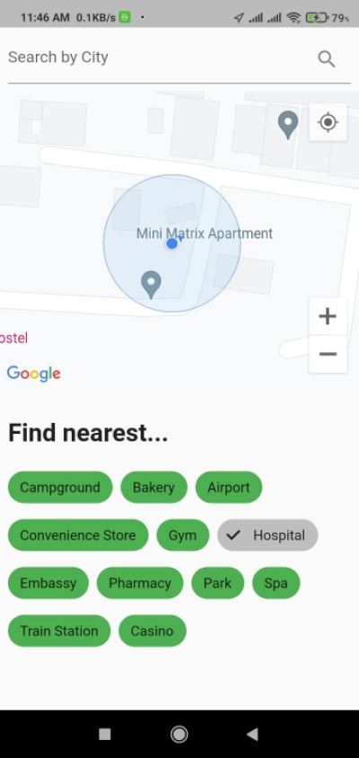

# Tripscape 🌴

<p align="center">
   
</p>
<!-- PROJECT LOGO -->

[](https://GitHub.com/Naereen/StrapDown.js/graphs/commit-activity)

<!-- ABOUT THE PROJECT -->
## Built With
* **Frontend**
   -  Flutter
   -  Dart

* **Backend & Libraries**
   -  Geolocator
   -  Google Maps Flutter
   -  Provider

*  **API**
   -  Places API
   -  Google Maps API
---

## ✨ Screenshot

| Homescreen | Homescreen (Filter enabled) |
| - | - |
|  |  |

<!-- BUILT WITH -->  

## 📲 How to Install Locally

**1. Fork and clone this repository using**

   ```
   git clone https://github.com/soumyadeep6845/Tripscape.git
   cd Tripscape/
   ```  
**2. Generate your own API key here**

   [Google Cloud Platform](https://console.cloud.google.com/home/dashboard)

**3. Create a .env file in root directory and add**  

   ```
   GOOGLE_API_KEY=XXXXXXXXXXXXXXXXXXXXXXXXXXXXXXXXXXXXXXX
   ```
**4. Install the required dependencies using**  

   ```
   flutter packages get
   ```
**5. Connect any android device/emulator.**  

**6. Run and install the app, using**
   
   ```
   flutter run
   ```

**7. In case of general runtime difficulties, run**
   
   ```
   flutter clean
   ```
   and then,
   ```
   flutter packages get
   ```
---

## 🎈 Contributing

If you'd like to contribute, please **fork** the repository and then raise a PR with necessary changes. Thank you.

---

## 💚 Found this project interesting?

If you found this project useful, then please consider leaving a :star: on Github. Thank you! 😄

---

## 👨 Project Maintained By-

* [Soumyadeep Das](https://www.linkedin.com/in/soumya0021/)
